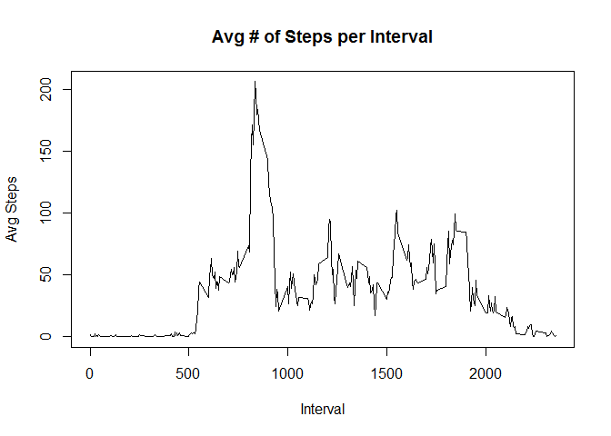
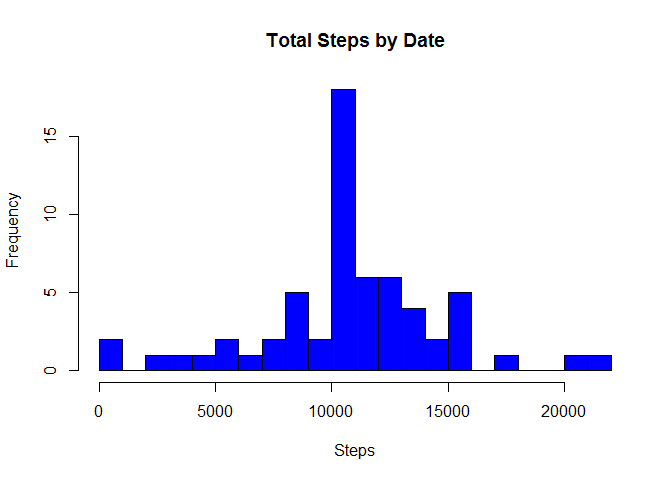
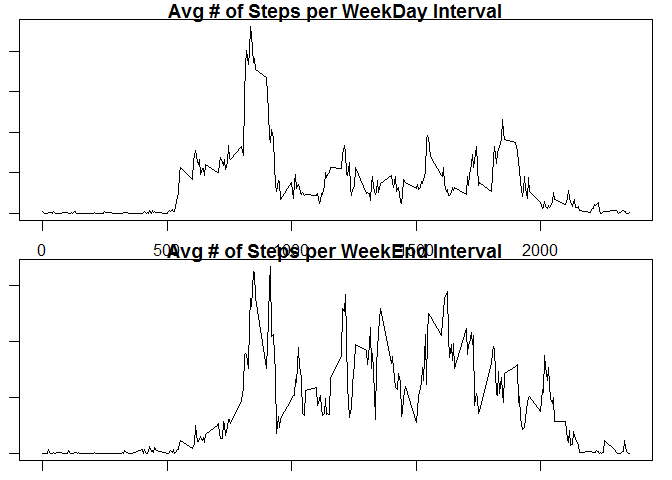

# Reproducible Research: Peer Assessment 1
James Matarese  
Sunday, July 19, 2015  
##Introduction
It is now possible to collect a large amount of data about personal movement using activity monitoring devices such as a Fitbit, Nike Fuelband, or Jawbone Up. These type of devices are part of the "quantified self" movement - a group of enthusiasts who take measurements about themselves regularly to improve their health, to find patterns in their behavior, or because they are tech geeks. But these data remain under-utilized both because the raw data are hard to obtain and there is a lack of statistical methods and software for processing and interpreting the data.

This assignment makes use of data from a personal activity monitoring device. This device collects data at 5 minute intervals through out the day. The data consists of two months of data from an anonymous individual collected during the months of October and November, 2012 and include the number of steps taken in 5 minute intervals each day.

Data

The data for this assignment can be downloaded from the course web site:

Dataset: Activity monitoring data [52K]
The variables included in this dataset are:

steps: Number of steps taking in a 5-minute interval (missing values are coded as NA)

date: The date on which the measurement was taken in YYYY-MM-DD format

interval: Identifier for the 5-minute interval in which measurement was taken

The dataset is stored in a comma-separated-value (CSV) file and there are a total of 17,568 observations in this dataset.

## Loading and preprocessing the data
=====================================
Set working directory, laod any packages needed and read in the initial csv.

```r
setwd("C:/Users/Matarese_Desktop/Desktop/Job Search III/R")
library(dplyr)
```

```
## 
## Attaching package: 'dplyr'
## 
## The following object is masked from 'package:stats':
## 
##     filter
## 
## The following objects are masked from 'package:base':
## 
##     intersect, setdiff, setequal, union
```

```r
assn <- read.csv("activity.csv")
```
The initial csv file contains 2304 Na's in the "steps" column which I've left blank for the fist steps in the anaylsis. 

## What is mean total number of steps taken per day?
======================================
Here, I've grouped the file by dates and summarized those dates by the total number of steps.  Simply taking the mean and mediam of each date yields the answer.

```r
assn_date <- group_by(assn,date)
steps <- summarize(assn_date,steps=sum(steps))
hist(steps$steps,breaks=25,main="Total Steps by Date",xlab="Steps",col="blue")
```

 

```r
mean(steps$steps,na.rm=T)
```

```
## [1] 10766.19
```

```r
median(steps$steps,na.rm=T)
```

```
## [1] 10765
```

## What is the average daily activity pattern?
======================================
In this step, I've grouped the data by interval, summarized the mean of each interval and plotted the results.  Then simply filtering for the max mean over each interval yeilds the the interval with the max avg number of steps.

```r
assn_interval <- group_by(assn,interval)
interval <- summarize(assn_interval,avg=mean(steps,na.rm=T))
plot(interval$interval,interval$avg,type="l",main="Avg # of Steps per Interval",xlab="Interval",ylab="Avg Steps")
```

 

```r
filter(interval,avg==max(interval$avg))
```

```
## Source: local data frame [1 x 2]
## 
##   interval      avg
## 1      835 206.1698
```

## Imputing missing values
=======================================
In this step, I've filled in the missing "steps" by assigning each missing value it's corresponding interval average as computed in the previous step.  This method will not change the mean of the total number of steps taken per day but will make the median more closely resemble the mean.

```r
#summary(assn)
sum(is.na(assn))
```

```
## [1] 2304
```

```r
for(i in 1:nrow(assn)){
  if(is.na(assn[i,1])==T){
    int_num <- assn[i,3]
    aa <- filter(interval,interval==int_num)
    aa <- select(aa,avg)
    assn[i,1] <- aa
  }
}
assn_date <- group_by(assn,date)
steps <- summarize(assn_date,steps=sum(steps))
hist(steps$steps,breaks=25,main="Total Steps by Date",xlab="Steps",col="blue")
```

 

```r
mean(steps$steps,na.rm=T)
```

```
## [1] 10766.19
```

```r
median(steps$steps,na.rm=T)
```

```
## [1] 10766.19
```


## Are there differences in activity patterns between weekdays and weekends?
In this section I've labeled each date by its corresponding day of the week and plotted the average number of steps taken per interval based on weekends and weekdays.  The plots are in the same panel so that the comparison is more easily made.

```r
assn[,2] <- as.Date(assn[,2],"%Y-%m-%d")
assn <- mutate(assn,wday=weekdays(assn$date))
weekend <- filter(assn,wday=="Sunday"|wday=="Saturday")
weekday <- setdiff(assn,weekend)
weekend_interval <- group_by(weekend,interval)
weekend_interval <- summarize(weekend_interval,avg=mean(steps))
weekday_interval <- group_by(weekday,interval)
weekday_interval <- summarize(weekday_interval,avg=mean(steps))
par(mar=c(1,1,1,1))
par(mfrow=c(2,1))
plot(weekday_interval$interval,weekday_interval$avg,type="l",main="Avg # of Steps per WeekDay Interval")
plot(weekend_interval$interval,weekend_interval$avg,type="l",main="Avg # of Steps per WeekEnd Interval")
```

 
